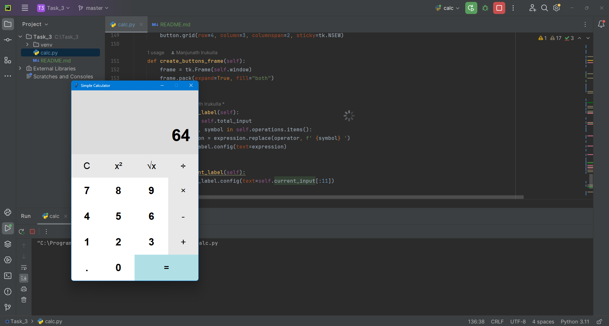

# Simple Calculator

This project is a simple calculator application developed using Python's `tkinter` library. It allows users to perform basic arithmetic operations such as addition, subtraction, multiplication, and division. The calculator also includes functionality for square and square root operations.

## Table of Contents

- [Features](#features)
- [Installation](#installation)
- [Usage](#usage)
- [Code Structure](#code-structure)
- [Screenshots](#screenshots)
- [License](#license)

## Features

- Basic arithmetic operations: addition, subtraction, multiplication, and division.
- Special functions: square and square root.
- Clear button to reset the current and total expressions.
- Responsive GUI layout using `tkinter`.
- Keyboard support for entering digits and operations.

## Installation

1. **Clone the repository:**

   ```sh
   git clone https://github.com/yourusername/simple-calculator.git
   ```

2. **Navigate to the project directory:**

   ```sh
   cd simple-calculator
   ```

3. **Install required dependencies:**

   Ensure you have Python installed. This project uses the `tkinter` library, which is included with most Python installations.

## Usage

1. **Run the application:**

   ```sh
   python calculator.py
   ```

2. The calculator window will open. You can use the on-screen buttons or your keyboard to enter digits and perform operations.

## Code Structure

- `calculator.py`: Main application file containing the `SimpleCalculator` class and the logic for the calculator.

### Key Classes and Functions

- **`SimpleCalculator`**: Main class for the calculator application.
  - **`__init__`**: Initializes the calculator window and components.
  - **`create_display_frame`**: Creates the frame for displaying expressions.
  - **`create_display_labels`**: Creates labels to show the current and total expressions.
  - **`create_buttons_frame`**: Creates the frame for the calculator buttons.
  - **`create_digit_buttons`**: Creates buttons for digits (0-9) and the decimal point.
  - **`create_operation_buttons`**: Creates buttons for arithmetic operations.
  - **`create_special_buttons`**: Creates special function buttons (clear, equals, square, and square root).
  - **`add_digit`**: Handles digit button clicks.
  - **`add_operator`**: Handles operation button clicks.
  - **`evaluate`**: Evaluates the expression.
  - **`clear`**: Clears the current and total expressions.
  - **`update_total_label`**: Updates the total expression label.
  - **`update_current_label`**: Updates the current expression label.
  - **`run`**: Runs the main loop of the application.

## Screenshots




## License

This project is licensed under the MIT License - see the [LICENSE](LICENSE) file for details.

---

This project was created as part of an internship at CodSoft, Batch 46. For any queries or issues, please contact **imanjunad@gmail.com**.

